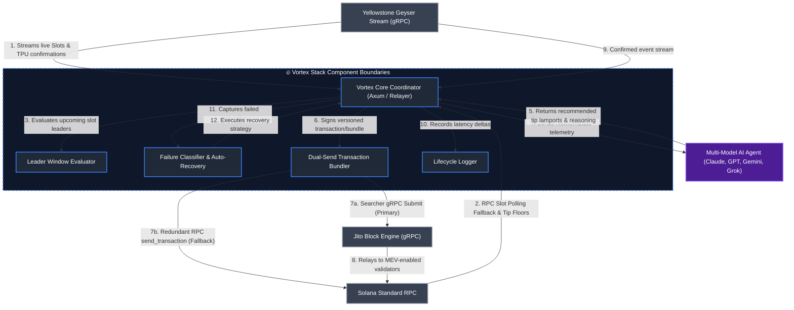

# 🏛 Vortex Architecture & System Design

This document details the architectural design, technical decisions, and component implementations of **Vortex**, a Solana transaction execution stack.

---

## 1. Core Technical Challenges

Standard transaction submission on Solana faces three main bottlenecks during network congestion:

1. **Confirmation Latency:** Polling `getSignatureStatuses` over HTTP RPC introduces polling overhead and subjects clients to RPC rate limits.
2. **Static Tip Pricing:** Hardcoded priority fees or static Jito tips fail to adapt dynamically during MEV spikes, leading to dropped bundles or excessive tip expenditure.
3. **Single-Path Execution Failures:** Relying solely on unauthenticated HTTP bundle submission can lead to silent drops during high-load slots when validators switch or skip slots.

---

## 2. High-Level Architecture

---

## 3. System Components & Technical Trade-offs

### 3.1 Telemetry & Confirmation Streaming (Yellowstone Geyser)

- **Problem:** HTTP RPC polling introduces 1-2 second latency delays and is prone to HTTP 429 rate-limiting.
- **Implementation:** Vortex opens a persistent gRPC stream using `yellowstone-grpc-client` to subscribe directly to slot updates and transaction events at `Processed` commitment.
- **Fallback:** If gRPC endpoint credentials are omitted or connection fails, the engine falls back to an async RPC slot-polling task (`vortex::geyser::rpc_fallback::poll_slots`) operating on a 400ms interval.

### 3.2 Dynamic Tip Evaluation (Multi-Model AI Agent)

- **Problem:** Static tip strategies cannot respond to real-time MEV tip floor surges.
- **Implementation:** The `vortex::agent` module constructs a `NetworkState` struct containing current slot number, Jito tip floor percentiles (25th, 50th, 75th, 95th), recent local failure rate (%), and seconds elapsed since last successful landing.
- **Guardrails:** Responses from LLM providers (Anthropic Claude, OpenAI GPT, Google Gemini, xAI Grok) are parsed as JSON and strictly clamped to bounds:
  - **Floor:** 1,000 lamports (prevents zero-tip submissions).
  - **Ceiling:** 5,000,000 lamports (0.005 SOL) under normal conditions, or `tip_max` when local failure rate > 50%.
- **Fallback:** If API calls fail or credentials are unavailable, `vortex::agent::decisions::fallback_tip` returns the clamped 50th percentile tip floor.

### 3.3 Execution Redundancy (Native Jito gRPC & Dual-Send)

- **Problem:** Protobuf crate dependency version mismatches between official Jito searcher libraries and `solana-client v1.18`.
- **Implementation:** Jito's official `.proto` schemas were imported directly into `crates/vortex/proto/` and compiled natively during build via `tonic-build` and `prost` in `crates/vortex/build.rs`.
- **Dual-Send Strategy:** When a transaction is submitted, `vortex::jito::bundle::submit_bundle` simultaneously dispatches the versioned transaction over Jito searcher gRPC (`send_bundle_no_wait`) and redundantly fires it to a standard Solana RPC endpoint. This provides execution redundancy if a Jito leader skips a slot or gRPC delivery fails.

### 3.4 Slot Leader Prediction (`vortex::jito::leader`)

- **Implementation:** The `LeaderTracker` inspects the upcoming 20 slots using `rpc_client.get_slot_leaders`.
- **Note on Current Prototype:** In the current code layout, `is_jito_validator` acts as a stub function returning `true` for demonstration within test environments. In production, this cross-references live Jito validator directory endpoints.

### 3.5 Failure Classifier & Autonomous Recovery Loop

- **Implementation:** Errors returned during transaction submission or confirmation timeouts are categorized by `vortex::failures::classifier::classify` into failure types (`ExpiredBlockhash`, `FeeTooLow`, `LeaderSkipped`, `ComputeExceeded`, `BundleFailure`, `Unknown`).
- **Recovery Action:** In daemon mode, `analyze_failure` prompts the AI agent for a corrective action. If `refresh_blockhash` or `increase_tip` is prescribed, Vortex automatically retrieves a fresh blockhash, applies the suggested tip multiplier, and resubmits the transaction.

### 3.6 Ephemeral Private Routing (`vortex::jito::bundle::submit_private_transfer_bundle`)

- **Implementation:** Supports creating an ephemeral "burner" keypair in memory. Constructs a multi-instruction transaction that transfers funds from sender -> ephemeral keypair -> recipient alongside the Jito tip instruction. Because all instructions execute atomically within a single Jito block, funds pass through the ephemeral account in a single transaction without persistent intermediate state.

---

## 4. Summary of System Guarantees

* **Reliability Strategy:** Dual-path execution (Jito gRPC + standard RPC) improves landing probability during validator slot transitions.
* **Safety Bounds:** Hard programmatic limits prevent the AI layer from recommending unsafe or unbounded tip amounts.
* **Operational Liveness:** Automatic fallbacks ensure system functionality even if Yellowstone gRPC or AI provider APIs become unavailable.
