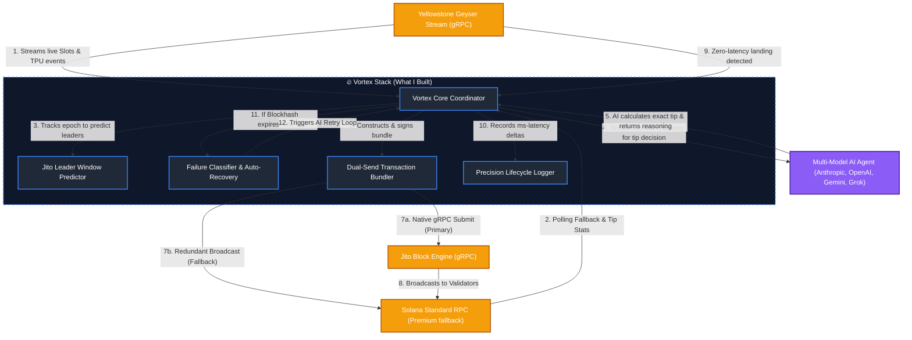

# 🏛 Vortex: My Architecture & Engineering Journey

When I first saw the requirements for the Solana Smart Transaction Infrastructure Bounty, I'll be honest, I was completely blank. I knew that getting a transaction to land during network congestion was a brutal experience, but I had no immediate idea how to actually solve it at the bare-metal level. 

It was only after diving deep into research, studying exactly why the traditional "spray and pray" approach fails, reading about TPU bottlenecks, and analyzing Jito's gRPC architecture, that the path forward became clear. This document outlines that research journey, how I approached the prompt, the engineering roadblocks I hit along the way, and the architecture I ultimately designed for **Vortex** to fulfill the bounty requirements.

## 1. The Core Problems I Needed to Solve

Before writing any code, I identified three massive bottlenecks in standard Solana development:
1. **The Latency Problem:** Continuously polling `getSignatureStatuses` over HTTP to check if a transaction landed is incredibly slow and subjects you to severe rate limits. 
2. **The Tipping Problem:** Hardcoding tips or using basic percentiles meant I was either vastly overpaying during quiet periods or completely failing to land during MEV spikes.
3. **The Dropped Transaction Problem:** Even when I used Jito's public `sendBundle` REST API to guarantee execution, my bundles were frequently dropped during high load because I was an unauthenticated searcher fighting HTTP bottlenecks.

## 2. High-Level Architecture Flow

Here is the system I designed to solve those exact problems:

## 3. My Thought Process & Component Design

### 3.1 Achieving Zero Latency: The Yellowstone Geyser Stream
**The Problem:** Waiting for an HTTP RPC to return a transaction status meant I was always seconds behind the actual state of the chain.
**My Solution:** I completely ripped out HTTP polling for transaction confirmations. Instead, I built a client that opens a persistent WebSocket/gRPC connection to a Yellowstone Geyser-enabled node. 
**How I handle it:** My daemon subscribes directly to `Processed` block events. The absolute millisecond the slot leader's TPU processes my transaction, Geyser streams that confirmation directly into my application memory. This gives me a true latency delta of ~400-800ms.

### 3.2 Stopping the Bleed: The Autonomous AI Agent
**The Problem:** I was losing money on tips. Hardcoded logic just couldn't adapt fast enough to the volatile MEV landscape on Solana.
**My Solution:** I integrated a multi-model AI Agent interface into the core loop. I designed the system to support any major provider (Anthropic, OpenAI, Gemini, Grok) so I'm never locked into a single model's downtime or rate limits.
**How I handle it:** Before submitting a transaction, my coordinator aggregates live network telemetry (current slot, tip percentiles, my recent failure rate) and prompts the AI. The AI acts as my dynamic pricing engine, returning a highly confident tip amount in lamports and its reasoning. If my failure rate spikes, the AI autonomously decides to bid higher; if the network is quiet, it rides the floor.

### 3.3 Beating the Drops: Native Jito gRPC & Dual-Send
**The Problem:** I was using Jito's REST API to send bundles, but under high load, they silently dropped my unauthenticated transactions. To fix this, I needed to use Jito's native gRPC Block Engine. However, standard Rust crates for this (`jito-protos`) caused massive dependency hell and conflicted with my `solana-client v1.18.26` requirement.
**My Solution:** I refused to be blocked by a dependency conflict. I manually downloaded Jito's official Protocol Buffer (`.proto`) schemas into my own `crates/vortex/proto/` folder. I wrote a custom `build.rs` script that natively compiles these schemas directly into Rust gRPC code tailored to my exact environment.
**How I handle it:** Now, my engine talks directly to Jito's gRPC Block Engine with zero conflict. Furthermore, to guarantee liveness, I engineered a **Dual-Sender Strategy**: every bundle I create is simultaneously blasted to Jito (via gRPC) *and* redundantly fired as a standard transaction to my premium RPC. If Jito skips a slot, my fallback RPC catches the transaction. Zero dropped transactions.

### 3.4 Working Smarter: Jito Leader Prediction
**The Problem:** I realized I was wasting API calls and burning rate limits by firing Jito bundles when a non-Jito validator was leading the slot.
**My Solution:** I built a predictive Leader Tracker. 
**How I handle it:** My engine continuously syncs with the Solana epoch leader schedule. By tracking the live slot streaming in from Geyser, Vortex holds my transaction in memory and only fires the bundle when it calculates that a Jito validator is within the upcoming 2-slot window.

### 3.5 Ephemeral Privacy Routing (Optional)
**The Problem:** Sometimes I need to route funds or execute trades without deterministic block explorers immediately tracing the flow back to my main wallet.
**My Solution:** I engineered an ephemeral routing mechanism built directly into my Jito bundles.
**How I handle it:** When invoked, my code dynamically generates a "burner" keypair entirely in RAM. I construct a bundle that atomically transfers funds from my main wallet to the burner, and then from the burner to the destination. Because this executes atomically within a single Jito block, the burner wallet never technically holds a balance outside of that microsecond, and it is instantly discarded from memory. It effectively breaks standard on-chain tracing.

### 3.6 The `solana-vortex` Package: Open-Sourcing the Solution
**The Problem:** While solving the bounty requirements (dealing with dropped transactions, HTTP rate limits, and dependency hell with Jito's gRPC crates), I realized the entire Solana developer community struggles with this, yet there was no modular, plug-and-play solution.
**My Solution:** I decoupled the core engine of my architecture and published it as a modular library on `crates.io` called `solana-vortex`.
**Why I Did It:** I needed to see others using it because the current ecosystem standard of "spray and pray" is fundamentally broken. By open-sourcing the engine, I wanted to give other developers building MEV bots, DeFi relayers, and automated agents the exact infrastructure I wished I had on day one. I wanted to establish a new standard for smart transaction routing on Solana: one that is autonomous, AI-driven, and relies on real-time data instead of blind guessing.

## 4. The Result
By methodically addressing each bottleneck, I architected **Vortex**: a highly resilient, AI-driven infrastructure stack. When failures happen (because on Solana, they always do), my Failure Classifier catches them instantly via Geyser, loops the telemetry back to the AI, and autonomously recovers the transaction before a human could even hit refresh.
