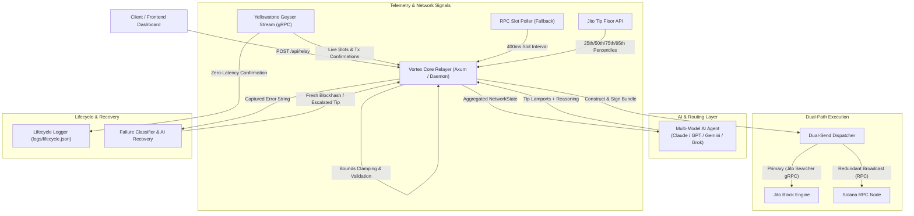

# Vortex: Solana Transaction Execution & Reliability Stack

<div align="center">
  
  
  
  
  
</div>

<br/>

> **🎥 Demo Video:** Coming soon

---

## 📌 Executive Summary

**Vortex** is a Solana transaction execution and reliability stack built in Rust.

During periods of high Solana network congestion, standard transaction delivery methods ("spray and pray") often suffer from dropped transactions, HTTP RPC rate limits, and inefficient fee estimation. Hardcoding fixed priority fees or static Jito tips either overpays during low-volume periods or fails to land during MEV spikes.

Vortex addresses these execution challenges by combining **real-time network telemetry**, **native gRPC streaming**, **dual-path submission**, and **AI-assisted dynamic tip decision making**.

- **Primary Repository:** [solana-tx-stack](https://github.com/Don-Vicks/solana-tx-stack)
- **Crate Package:** `solana-vortex` (`crates/vortex`)
- **Architecture Spec:** See [ARCHITECTURE.md](./ARCHITECTURE.md) for detailed technical design choices.

---

## 🛠 What I Built

I designed and implemented the following core components in this workspace:

* **Dual-Path Execution Engine (`crates/vortex/src/jito/bundle.rs`, `crates/core/src/main.rs`)** — Constructs signed transactions and bundles, simultaneously firing them over native Jito searcher gRPC (`send_bundle_no_wait`) and redundantly broadcasting them to a standard Solana RPC to maximize landing probability.
* **Yellowstone Geyser Stream & Fallback Poller (`crates/vortex/src/geyser/`)** — Real-time gRPC slot and transaction confirmation receiver with auto-reconnect logic, backed by a 400ms RPC slot polling fallback when gRPC is unconfigured.
* **Native Jito gRPC Compilation (`crates/vortex/build.rs`, `crates/vortex/proto/`)** — Direct integration of Jito's official Protocol Buffer schemas compiled via `tonic-build` / `prost`, avoiding dependency conflicts with `solana-client v1.18`.
* **Multi-Model AI Tip Engine (`crates/vortex/src/agent/`)** — Telemetry-driven decision layer supporting Anthropic Claude, OpenAI GPT, Google Gemini, and xAI Grok. Evaluates live slot metrics, Jito tip percentiles, and failure rates with strict hard bounds enforcement.
* **Failure Classifier & Recovery Daemon (`crates/vortex/src/failures/`, `crates/core/src/main.rs`)** — Categorizes RPC/bundle errors (`ExpiredBlockhash`, `FeeTooLow`, `LeaderSkipped`) and triggers an automated retry loop (fresh blockhash fetch, tip escalation).
* **Monitoring Dashboard & Relayer API (`crates/core/src/main.rs`, `frontend/`)** — Axum HTTP server (`/api/relay` endpoint on port 3000) and React 19 / Vite dashboard for real-time visualization of transaction states and confirmation latency deltas.

---

## 🤖 Where AI Fits

AI in Vortex operates strictly as a **constrained decision engine** embedded in the execution loop, rather than a conversational overlay.

```
┌─────────────────────────────────────────────────────────────┐
│ 1. INPUT TELEMETRY                                          │
│ - Current slot                                              │
│ - Jito tip floor percentiles (min, median, p75, p95)        │
│ - Recent failure rate (%) & seconds since last success      │
└──────────────────────────────┬──────────────────────────────┘
                               │
                               ▼
┌─────────────────────────────────────────────────────────────┐
│ 2. DECISION EVALUATION (LLM Agent / Heuristics)             │
│ - Anthropic / OpenAI / Gemini / Grok query                  │
│ - Prompts LLM for optimal tip lamports + concise reasoning  │
│ - Hard bounds clamping (Floor: 1,000, Ceiling: 5,000,000)   │
└──────────────────────────────┬──────────────────────────────┘
                               │
                               ▼
┌─────────────────────────────────────────────────────────────┐
│ 3. OUTPUT EXECUTION ACTION                                  │
│ - Recommended tip (in lamports)                             │
│ - Action decision (bundle submission vs standard RPC)       │
│ - Autonomous recovery action on failure                     │
└─────────────────────────────────────────────────────────────┘
```

### Current AI Implementation Details:

1. **Dynamic Tip Recommendation (`vortex::agent::decisions::decide_tip`)**:
   Passes live `NetworkState` to the configured LLM provider. The agent returns a JSON payload with `recommended_lamports`, `reasoning`, and `confidence`. To prevent LLM hallucination or overspending, the result is programmatically clamped between a hard floor (1,000 lamports) and a hard ceiling (5,000,000 lamports, or `tip_max` if failure rate exceeds 50%).
2. **Failure Analysis (`vortex::agent::decisions::analyze_failure`)**:
   When a transaction fails, raw RPC error strings are passed to the model to classify the cause and recommend a recovery strategy (`refresh_blockhash`, `increase_tip`, `wait`, `abort_insufficient_funds`, or `give_up`).
3. **Fallback Logic (`vortex::agent::decisions::fallback_tip`)**:
   If the AI provider times out, returns malformed output, or API keys are absent, Vortex falls back seamlessly to clamped Jito tip floor medians without halting transaction flow.
4. **Status**: Tip decision and error classification are active in the codebase; autonomous LLM re-submission loops in daemon mode represent an experimental prototype.

---

## 🏗 Architecture



For an in-depth breakdown of engineering decisions, Protobuf compilation choices, and telemetry mechanics, read [ARCHITECTURE.md](./ARCHITECTURE.md).

---

## 💻 Tech Stack

- **Language & Runtime:** Rust (2021 Edition), Tokio async runtime
- **Solana SDK:** `solana-sdk v1.18`, `solana-client v1.18`
- **Telemetry & Streaming:** Yellowstone Geyser gRPC (`yellowstone-grpc-client v1.15`), Solana HTTP RPC
- **Block Engine Integration:** Jito gRPC Searcher Engine (`tonic v0.10`, `prost v0.12` compiled via custom `build.rs`)
- **HTTP Server:** Axum (`axum v0.8`), Tower-HTTP CORS
- **AI Integrations:** Anthropic Claude, OpenAI GPT, Google Gemini, xAI Grok (via `reqwest`)
- **Frontend Dashboard:** React 19, Vite, TypeScript, Tailwind CSS, Lucide React

---

## 🚀 Quick Start & Local Demo

Vortex supports both an **API Mode** (HTTP relayer + React dashboard) and a **Daemon Mode** (autonomous evaluation loop).

### Prerequisites

- **Rust** (`cargo` 1.75+)
- **Node.js** (v18+) & `npm`
- **Solana CLI** (optional, for local keypairs)

### 1. Environment Configuration

Clone the repository and set up environment variables:

```bash
git clone https://github.com/Don-Vicks/solana-tx-stack.git
cd solana-tx-stack
cp .env.example .env
```

Configure `.env` with your RPC details and preferred AI provider key:

```env
SOLANA_RPC_URL="https://api.devnet.solana.com"
JITO_BLOCK_ENGINE_URL="https://mainnet.block-engine.jito.wtf"
LOG_FILE_PATH="./logs/lifecycle.json"

# AI Agent Configuration
AI_PROVIDER="anthropic" # Options: anthropic, openai, gemini, grok
AI_MODEL="claude-3-5-sonnet-20241022"
CLAUDE_API_KEY="sk-ant-..."

# Wallet Path (Must exist with SOL balance for live transactions)
WALLET_KEYPAIR_PATH="./keypair.json"
```

> **Note:** If no AI key is provided, Vortex gracefully falls back to deterministic tip floor medians.

### 2. Run the Backend (API Mode)

Start the HTTP relayer on `http://localhost:3000`:

```bash
cargo run --package core
```

*(To run the autonomous daemon loop instead, set `RUN_DAEMON=true` in your `.env` before running).*

### 3. Run the Frontend Dashboard

In a second terminal, launch the live tracking dashboard:

```bash
cd frontend
npm install
npm run dev
```

Open `http://localhost:5173` in your browser.

### 4. Safe Local Testing

To test the full execution flow safely:
1. Ensure your `.env` points to `SOLANA_RPC_URL="https://api.devnet.solana.com"`.
2. Generate a test keypair at `./keypair.json` using `solana-keygen new -o keypair.json` and request a devnet airdrop (`solana airdrop 2 keypair.json --url devnet`).
3. Use the **Vortex Transaction Sender** widget on the dashboard to send a test transfer (e.g. 0.01 SOL).
4. Watch the dashboard stream live submission state, AI tip reasoning, and confirmation status.

---

## 📦 Using `solana-vortex` as a Library

The core engine is published as a modular Rust crate. You can integrate `solana-vortex` directly into your Rust bots or relayers:

```toml
[dependencies]
solana-vortex = "0.1.3"
```

### Example Usage:

```rust
use vortex::agent::{AgentConfig, AiProvider, NetworkState, decisions};

#[tokio::main]
async fn main() -> Result<(), Box<dyn std::error::Error>> {
    let agent_config = AgentConfig {
        provider: AiProvider::Anthropic,
        model: "claude-3-5-sonnet-20241022".to_string(),
    };

    let network_state = NetworkState {
        current_slot: 284_900_100,
        tip_min: 10_000,
        tip_max: 5_000_000,
        tip_median: 200_000,
        tip_average: 350_000,
        recent_failure_rate: 15.5,
        time_since_last_success_secs: 45,
    };

    let tip_decision = decisions::decide_tip(&agent_config, &network_state).await?;

    println!("🤖 Agent Reasoning: {}", tip_decision.reasoning);
    println!("💰 Recommended Tip: {} lamports", tip_decision.recommended_lamports);

    Ok(())
}
```

---

## 🎬 Recommended 60–90 Second Demo Flow

When recording or evaluating a video demonstration of Vortex, follow this sequence:

1. **Start Backend & Dashboard (0:00 - 0:15)**: Show terminal starting `cargo run --package core` (relayer listening on port 3000) and `npm run dev` launching the Vite frontend.
2. **Dashboard Overview (0:15 - 0:30)**: Highlight the live telemetry panel, transaction counter, and event log table.
3. **Execute Transaction (0:30 - 0:50)**: Submit a transfer using the **Vortex Transaction Sender** widget. Show the HTTP request triggering the AI agent evaluation.
4. **Inspect AI Decision (0:50 - 1:10)**: Point out the AI reasoning string, recommended tip amount, and bounds clamping.
5. **Verify On-Chain Landing (1:10 - 1:30)**: Click the Solana Explorer signature link to verify transaction confirmation and Jito tip instruction execution on-chain.

---

## 📄 License

Dual-licensed under [MIT](LICENSE-MIT) or [Apache-2.0](LICENSE-APACHE).
